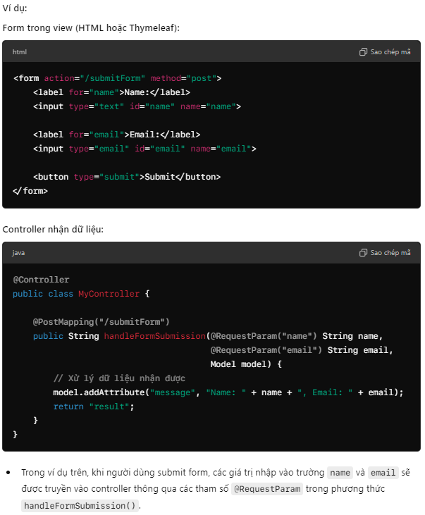

# Từ controller lên view:

- Model được sử dụng để truyền dữ liệu từ controller đến view. Nó hoạt động như một container chứa các thông tin mà bạn muốn hiển thị hoặc sử dụng trong trang web (view).

- Khi controller xử lý một request, dữ liệu thường cần phải được gửi từ backend đến view để hiển thị cho người dùng. Đối tượng Model giúp bạn làm điều này.

- Ví dụ:
  model.addAttribute("key", value);

=> Kết nối giữa controller và view: Nó mang dữ liệu mà bạn muốn hiển thị từ controller đến view.

# Từ view xuống controller:

View có thể truyền dữ liệu xuống controller thông qua nhiều cách khác nhau, phổ biến nhất là sử dụng form submissions và request parameters.

## 1. Thông qua form submissions (Gửi dữ liệu qua form) 

- Form trong view : action="/submitForm" method="post"
- Controller nhận dữ liệu : RequestParam
  @PostMapping("/submitForm")
  public String handleFormSubmission(@RequestParam("name") String name,
  @RequestParam("email") String email,
  Model model) {
  // Xử lý dữ liệu nhận được
  model.addAttribute("message", "Name: " + name + ", Email: " + email);
  return "result";
  }
  => Khi người dùng submit form, các giá trị nhập vào trường name và email sẽ được truyền vào controller thông qua các tham số @RequestParam trong phương thức handleFormSubmission().

## 2. Thông qua URL parameters (Truyền dữ liệu qua tham số URL) : Dữ liệu cũng có thể được truyền qua các tham số trong URL. 

<a href="/greet?name=John">Greet John</a>

// Controller nhận dữ liệu:
@Controller
public class MyController {

    @GetMapping("/greet")
    public String greetUser(@RequestParam("name") String name, Model model) {
        model.addAttribute("message", "Hello, " + name);
        return "greeting";
    }

}

## 3. Sử dụng @ModelAttribute để nhận đối tượng từ form: Spring MVC hỗ trợ tự động ánh xạ các dữ liệu từ form đến một đối tượng (model object). 

Form trong view:

<form action="/register" method="post">
    <label for="username">Username:</label>
    <input type="text" id="username" name="username">

    <label for="password">Password:</label>
    <input type="password" id="password" name="password">

    <button type="submit">Register</button>

</form>

// --------------------------------------
Controller nhận dữ liệu:

@Controller
public class UserController {

    @PostMapping("/register")
    public String registerUser(@ModelAttribute User user, Model model) {
        // Xử lý dữ liệu của người dùng
        model.addAttribute("message", "Registered user: " + user.getUsername());
        return "result";
    }

}

Đối tượng User:
public class User {
private String username;
private String password;

    // getters and setters

}

## 4. Sử dụng @PathVariable để lấy dữ liệu từ URL: Dữ liệu cũng có thể được truyền xuống controller thông qua các biến trong đường dẫn URL. 
